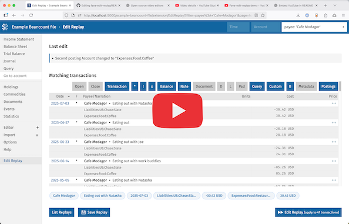

# Fava Edit Replay

A bulk edit extension for [Fava](https://beancount.github.io/fava/), the web interface for Beancount.

Watch the video:

[](https://www.youtube.com/watch?v=xuy0AhDnU-U)


## What it does

This extension allows you to:
- Apply bulk edits to multiple Beancount transactions at once
- Save edit operations (a combination of search filters and a diff) as "replays" that can be applied later
- Filter transactions by account, time period, or custom filters
- Suggests filters based on last modified transaction

## Installation

```bash
pip install git+https://github.com/paulsc/fava-edit-replay
```

## Usage

### Through Fava

1. Add the extension to your ledger. 
```bash
2000-11-11 custom "fava-extension" "fava_edit_replay" "{ 'db': 'my-replays.yaml' }"
```
The 'db' option specifies the path of the yaml database file containing your saved replays.

2. Make an edit using the built-in slice editor in Fava.

3. Open the extension through the "Edit Replay" item in the sidebar. Modify the search filters, the click the "Edit Replay" in the bottom right corner to bulk-apply your last edit. 

### Command Line

Use the command line tool to apply all the replays to your ledger.
```bash
fava-edit-replay replays.yaml ledger.beancount
```
